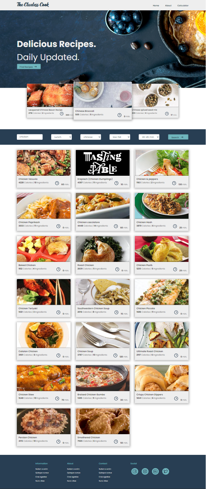

# The Clueless Cook

Do you never know what to cook when you come home from a day of work?   
Do you want to know the nutritional values of your favorite recipe?  
Do you want to know how many calories that product has when you're in the grocery store? 
Look no further, **The Clueless Cook** will give you all the answers! 

## Table of Contents

1. [What does the application do?](#section-1)
2. [Preview of the project's homepage](#section-2)
3. [Edamam walkthrough](#section-3)
4. [How to install the application](#section-4) 
   4.1 [Install Node.js and npm](#section-4-a) 
   4.2 [Installing dependencies](#section-4-b) 
   4.3 [Use of the API's](#section-4-c) 
5. [Bonus](#section-5)
6. [Need help?](#section-6)
7. [Credits](section-7)
---

### 1. <a name="section-1">What does the application do?</a>
_The application has three pages with their own respective function._

* **Homepage**
  * The homepage has a search function for finding recipes. The search function has multiple search options such as; 
    * mealtype, 
    * cuisine, 
    * diet
    * cooking time.  
  * The search function will show 20 recipes matching the search query.
  * The homepage has also featured recipes in the header. In this particular case it has three featured recipes of the Chinese cuisine. You can change it to what you want, more on this in the "how to install this application" section.
* **Recipe Page**
  * The recipe page contains the following; 
    * Recipe title
    * ingredients list
    * recipe image
    * nutrients table
    * health labels
  * The recipe page is completely automated and get's the information through the use of API.
* **Calorie Calculator**
  * The calculator can search by type of product
    * It gives the average corresponding serving size per product
  * Add the amount of servings to the selected product
  * When added amount is send it will give you a table with the added amount of products, with information on carbs, fat and calories.
---
### 2. <a name="section-2">Preview of the project's homepage</a>

---
### 3. <a name="section-3">Edamam walkthrough</a>
_If it's your first time using Edamame API please follow these instructions._
1. Go to the [Edamam](https://developer.edamam.com) website
2. Click on Sign Up, fill in the form. 
  _They will ask for:_
   * A username
   * your email
   * a password
   * organisation (you can fill out what you want)
   * Ask what type of plan you want (choose recipe search API -Developer)
3. **Log in** to the website
4. Click on the **menu** icon (three horizontal lines) 
5. Click on **Accounts**
6. Click on **Go to Dashboard**
7. Click on **Applications** 
_Now we need a second application for this project_
8. Click on **create new application**
9. Click on **Food Database API**, give it a name and description. 
10. Click on **create Application**
11. You will see your **Application ID** and the **Application KEYS**.
12. Click in the menu (below the header image) on **Applications**.
13. You will see two API's one is **Recipe Search API** and the other is **Food Database API**, you will need both for the application.
14. Click on **view** to see the corresponding ID and KEY.
15. Documentation on **Recipe Search API** can be found [here](https://developer.edamam.com/edamam-docs-recipe-api)
16. Documentation on **Food Database API** can be found [here](https://developer.edamam.com/food-database-api-docs)
---
### 4. <a name="section-4">How to install the application</a>
You can use whatever IDE (code editor) you want. Visual Studio Code is free! 
_If you're not familiar with using an IDE, I would recommend watching [this](https://www.youtube.com/watch?v=VqCgcpAypFQ) tutorial for beginners first. This tutorial is for Visual Studio Code, if you use another IDE please feel free to look around on youtube for beginner tutorials on the specific IDE._
#### 4.1. <a name="section-4-a">Install Node.js and npm</a> 
   Before you start, make sure you have Node.js and npm installed on your system. Go to the [Nodejs](https://nodejs.org/en/download/) website to download and install the latest version. 
   This application is set up with Node.js v16.15.0 and npm v8.5.5 
   Want to check which versions are installed on your system? 
   Run the following commands in the terminal: 
 
   `node -v` 
    
   `npm -v` 
    
   
#### 4.2. <a name="section-4-b">installing dependencies</a>
All the (development) dependencies are mentioned in the package.json file. Install them all at once by running the following command in the terminal; 
 
`npm install` 
 
The following development dependencies are used. _The version number is a minimum version._

> buffer: v6.0.3 
> parcel: v2.7.0 
> parcel-plugin-nuke-dist: v1.0.1 
> process: v0.11.10 

The following dependencies is used. _The version number is a minimum version._

> axios v0.27.2

#### 4.3. <a name="section-4-c">Use of the API's</a>
This is the part where you're going to use the Recipe Search API and Food Database API. In this application V2 is being used. 
 
For the **Recipe Search API** you will need to place your ID (8 characters long) and your KEY (32 characters long) in the following javascript files; 
* fetchRecipeData.js at;
  * line 13 `API_ID` replace "#" with your ID
  * line 14 `API_KEY` replace "#" with your KEY
* fetchRecipeDataHeader.js at;
  * line 12 `API_ID` replace "#" with your ID
  * line 13 `API_KEY` replace "#" with your KEY
* fetchRecipePage.js at;
  * line 25 `API_ID` replace "#" with your ID
  * line 26 `API_KEY` replace "#" with your KEY
 
  * For the **Food Database API** you will need to place your ID and KEY in the following javascript file; 
    * fetchCalculatorData.js at;
      * line 10 `API_ID` replace "#" with your ID
      * line 11 `API_KEY` replace "#" with your KEY
 
---

### 5. <a name="section-5">Bonus</a>
Do you want to change the featured recipes to something else? 
1. go to the main.js file
2. find line 30
3. replace `chinese` with a different search word. You can als use ingredients instead of cuisine for ex. `potato`.
---

### 6. <a name="section-6">Need Help?</a>
If you run in to any issues, or have questions, please [contact me](https://github.com/NostromosTeaCup). I'm happy to help you out! 
---

### 7. <a name="section-7">Credits</a>

This application is build as an exam assignment for [Hogeschool Novi](https://github.com/hogeschoolnovi/) bootcamp for Webdevelopment. 
The original design is made by [Elwyn de Neve](https://github.com/elwyn-de-neve/). 
The HTML, CSS and JS is completed by myself.